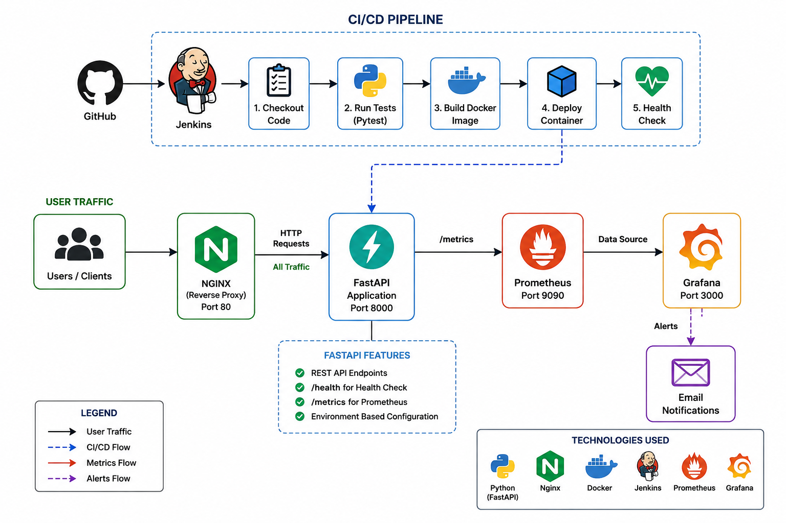

# Project Overview

This project implements a production-oriented REST API with a complete DevOps and SRE workflow.

The application is built using **Python and FastAPI**, containerized with **Docker**, and exposed through **Nginx** as a reverse proxy. **Jenkins** automates the CI/CD pipeline from source-code checkout through testing, Docker image creation, deployment, and health verification.

For observability, the application exposes Prometheus metrics. **Prometheus** collects those metrics, while **Grafana** provides dashboards and alerting for application behavior such as request rate, HTTP errors, and request latency.

The project demonstrates an end-to-end workflow covering development, automated testing, containerization, deployment, monitoring, and alerting.

# API Documentation

## Endpoints

| Method | Endpoint | Description | Expected Status |
|---|---|---|---:|
| GET | `/` | Returns basic application information | 200 |
| GET | `/health` | Returns application health status | 200 |
| GET | `/api/info` | Returns application name and version | 200 |
| GET | `/metrics` | Exposes Prometheus metrics | 200 |
| GET | `/invalid-endpoint` | Example of an undefined endpoint | 404 |

## Request/Response examples

### GET `/`

**Response:**

```json
{
  "message": "DevOps SRE Assessment API",
  "status": "running"
}
```

### GET `/health`

**Response:**

```json
{
  "status": "healthy"
}
```

### GET `/api/info`

**Response:**

```json
{
  "application": "DevOps SRE Assessment API",
  "version": "1.0.0"
}
```

### Invalid endpoint

Request:

```text
GET /does-not-exist
```

Expected HTTP status:

```text
404 Not Found
```

FastAPI also provides standard HTTP error handling for invalid routes. Unexpected application exceptions are handled through a global exception handler and return HTTP 500 with an internal-server-error response.

# Architecture

## Architecture diagram

The system is organized around a containerized FastAPI application with Nginx handling incoming HTTP traffic, Jenkins handling CI/CD automation, and Prometheus/Grafana providing observability.

Add the architecture image to the repository using the following path:

```text
screenshots/architecture.png
```

Then reference it in this section with:

```markdown

```

The architecture should visually show:

- Client → Nginx
- Nginx → FastAPI
- FastAPI → Prometheus through `/metrics`
- Prometheus → Grafana
- GitHub → Jenkins
- Jenkins → Test → Docker Build → Deploy → Health Check

## Components

| Component | Technology | Purpose |
|---|---|---|
| REST API | Python / FastAPI | Provides application endpoints |
| Reverse Proxy | Nginx | Receives HTTP requests and forwards them to FastAPI |
| Containerization | Docker | Packages and runs the application |
| Orchestration | Docker Compose | Runs the local multi-container stack |
| CI/CD | Jenkins | Automates testing, image building, deployment, and health verification |
| Metrics | Prometheus | Collects application metrics |
| Monitoring | Grafana | Visualizes metrics and provides alerting |
| Testing | Pytest | Validates API behavior |
| Source Control | GitHub | Stores source code and triggers the CI/CD workflow |

# Prerequisites

Install the following before running the project:

- Git
- Python 3.x
- Docker
- Docker Compose
- Jenkins
- Prometheus
- Grafana

Make sure the required local ports are available:

- `80` — Nginx
- `8000` — FastAPI application
- `8080` — Jenkins
- `9090` — Prometheus
- `3000` — Grafana

# Setup & Installation

## Clone the repository

```bash
git clone https://github.com/sky7-devops/devops-sre-assessment.git
cd devops-sre-assessment
```

## Create a Python virtual environment

```bash
python3 -m venv .venv
source .venv/bin/activate
```

## Install dependencies

```bash
pip install -r app/requirements.txt
```

## Run tests

```bash
pytest
```

The test suite validates the root endpoint, health endpoint, application information endpoint, and 404 handling.

## Run the API locally

```bash
uvicorn app.main:app --reload --port 8000
```

The API is then available at:

```text
http://localhost:8000
```

# Docker Setup

## Build the Docker image

```bash
docker build -t devops-sre-api .
```

## Run the API container

```bash
docker run -d \
  --name devops-sre-api \
  -p 8000:8000 \
  -e APP_NAME="DevOps SRE Assessment API" \
  -e APP_VERSION="1.0.0" \
  devops-sre-api
```

## Run the complete stack with Docker Compose

The project includes Docker Compose configuration for the API, Nginx, Prometheus, and Grafana.

Start the stack:

```bash
docker compose up -d --build
```

Check running containers:

```bash
docker compose ps
```

Stop the stack:

```bash
docker compose down
```

# Nginx Configuration

Nginx is configured as a reverse proxy in front of the FastAPI application.

Incoming requests are received on port `80` and forwarded to the FastAPI service running on port `8000`.

The configuration is stored at:

```text
nginx/nginx.conf
```

Access the application through Nginx:

```text
http://localhost/
```

Health check through Nginx:

```bash
curl http://localhost/health
```

Expected response:

```json
{
  "status": "healthy"
}
```

# CI/CD

## Jenkins setup

Jenkins is used to automate the CI/CD workflow.

The Jenkins pipeline is configured as a **Pipeline from SCM** and uses the GitHub repository:

```text
https://github.com/sky7-devops/devops-sre-assessment.git
```

The pipeline definition is stored in:

```text
Jenkinsfile
```

Jenkins checks out the latest source code from the `main` branch and executes the pipeline automatically when it is run.

## Pipeline stages

The pipeline contains the following stages:

### 1. Checkout

Jenkins retrieves the latest source code from GitHub.

### 2. Test

A Python virtual environment is created and project dependencies are installed.

Pytest is then executed to validate the API.

### 3. Docker Build

Jenkins builds the Docker image:

```bash
docker build -t devops-sre-api .
```

### 4. Deploy

The existing API container is removed if present, and a new container is started from the newly built image.

The deployed container is connected to the Docker network used by the application stack.

### 5. Health Check

Jenkins verifies that the deployed application responds successfully through the `/health` endpoint.

A successful pipeline confirms that the code was tested, the image was built, the application was deployed, and the deployed application is healthy.

# Monitoring

## Prometheus

The FastAPI application exposes application metrics through:

```text
/metrics
```

Prometheus is configured to scrape the API using the target:

```text
api:8000
```

The Prometheus configuration is stored at:

```text
prometheus/prometheus.yml
```

Prometheus can be accessed locally at:

```text
http://localhost:9090
```

The Prometheus target should show the FastAPI application as **UP**.

## Grafana

Grafana is used as the visualization and monitoring layer on top of Prometheus.

Grafana can be accessed locally at:

```text
http://localhost:3000
```

Prometheus is configured as the Grafana data source.

The dashboard includes:

- Request rate
- Total HTTP requests
- 5xx error rate
- 95th percentile request latency

The dashboard is named:

```text
DevOps SRE Application Monitoring
```

## Alerts

A Grafana alert rule has been configured to monitor HTTP 5xx errors.

Alert name:

```text
High 5xx Error Rate
```

The alert evaluates the 5xx request rate and triggers when the configured threshold is exceeded for the specified evaluation period.

Email notification is configured through a Grafana contact point.

# Configuration / Environment Variables

The application uses environment variables for basic configuration.

| Variable | Description | Default |
|---|---|---|
| `APP_NAME` | Application name | `DevOps SRE Assessment API` |
| `APP_VERSION` | Application version | `1.0.0` |

Example `.env` configuration:

```env
APP_NAME=DevOps SRE Assessment API
APP_VERSION=1.0.0
```

The `.env` file is excluded from Git using `.gitignore`.

# AWS Deployment (Optional)

AWS deployment was optional for this assessment and was not implemented in the submitted local environment.

The application is fully demonstrated using Docker, Docker Compose, Nginx, Jenkins, Prometheus, and Grafana in a local environment.

## AWS architecture

Not implemented.

## Services used

No AWS services are used in the current implementation.

## Public API URL

No public AWS API URL is available because AWS deployment was not implemented.

# Screenshots

The following screenshots should be added to demonstrate the completed implementation.

Store them inside:

```text
screenshots/
```

Recommended files:

### 1. Architecture

```text
screenshots/architecture.png
```

A clean architecture diagram showing the relationship between GitHub, Jenkins, Docker/FastAPI, Nginx, Prometheus, and Grafana.

### 2. Jenkins Pipeline

```text
screenshots/jenkins-success.png
```

Show the Jenkins build with all pipeline stages completed successfully.

### 3. Nginx / API Health Check

```text
screenshots/nginx-health.png
```

Show the `/health` endpoint responding successfully through Nginx.

### 4. Prometheus Target

```text
screenshots/prometheus-target.png
```

Show the FastAPI Prometheus target with status `UP`.

### 5. Grafana Dashboard

```text
screenshots/grafana-dashboard.png
```

Show the completed monitoring dashboard with request rate, request count, 5xx errors, and latency.

### 6. Grafana Alert

```text
screenshots/grafana-alert.png
```

Show the `High 5xx Error Rate` alert rule and its configured notification contact point.

These screenshots provide visual evidence of the CI/CD pipeline, reverse proxy, metrics collection, dashboard, and alerting configuration.
